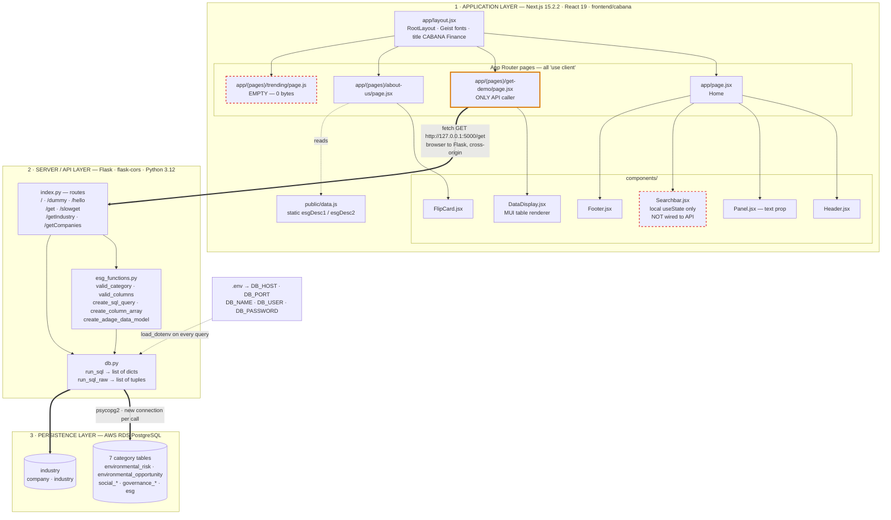
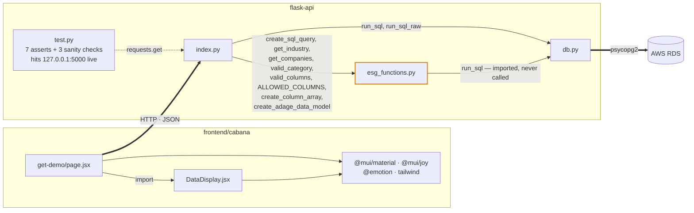
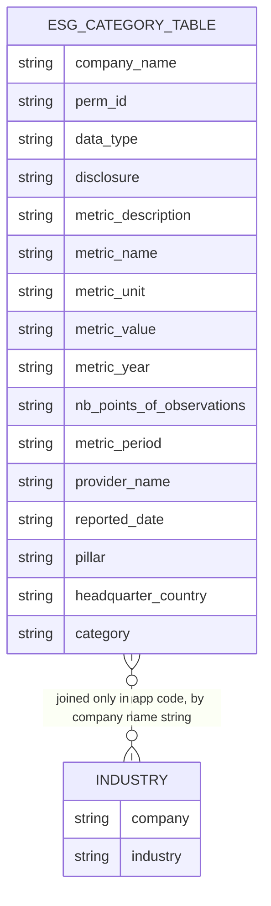
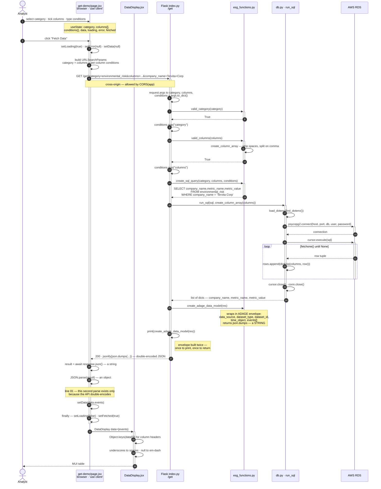
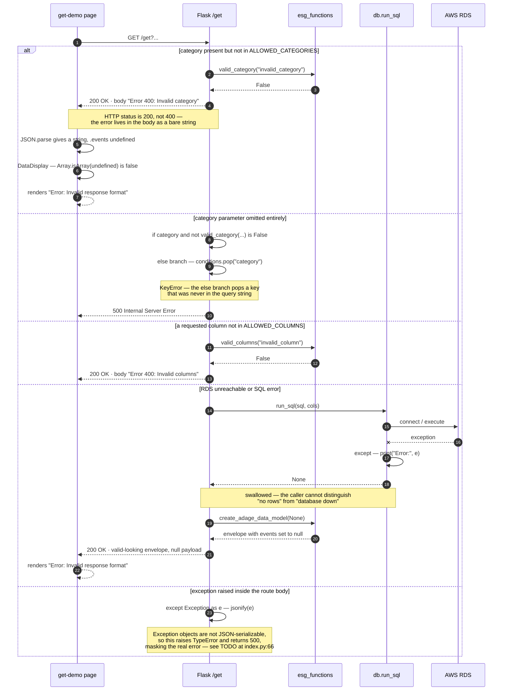
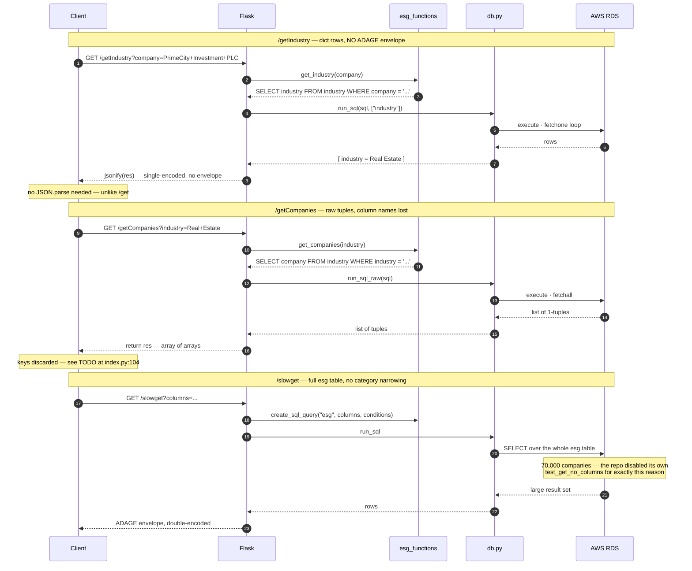
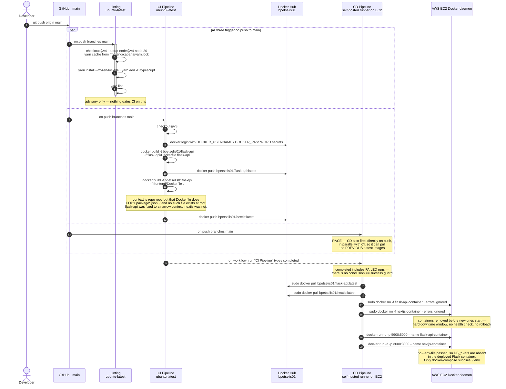
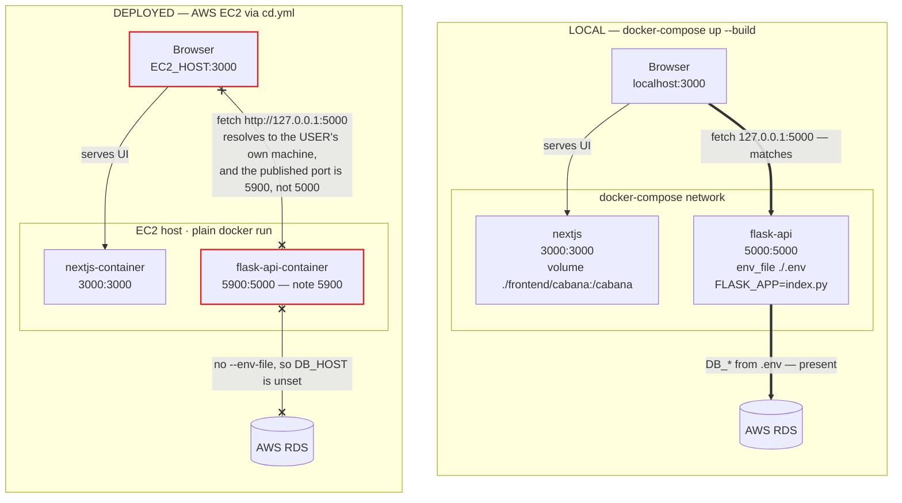

# CABANA Finance — Architecture

ESG Investment Dashboard. Diagrams below are traced from the source in `Project Repo/`, not from the
layer summary in the README.

**Layers as declared:**

| Layer | Stack | Location |
|---|---|---|
| Application | Next.js 15.2.2, React 19 | `Project Repo/frontend/cabana` |
| Server / API | RESTful, Python 3.12, Flask | `Project Repo/flask-api` |
| Persistence | AWS RDS (PostgreSQL) | accessed via `db.py` |
| Deployment | Docker Hub, AWS EC2, GitHub Actions | `docker-compose.yml`, `.github/workflows/` |

The single most important architectural fact, which shapes every diagram: **there are no Next.js API
routes and no server-side data fetching.** Every page carries `'use client'`, and the only outbound
call is at `frontend/cabana/app/(pages)/get-demo/page.jsx:76` — the *browser* calls Flask directly.

---

## 1. Layered Architecture

Next.js here is a client-rendered shell, not a server. `'use client'` on every page plus a
browser-side `fetch` to a different origin means none of the App Router's server-fetch benefits
apply, and `CORS(app)` at `index.py:9` becomes load-bearing rather than incidental.

The dashed red nodes are real gaps: `Searchbar.jsx` holds six pieces of filter state
(`searchQuery`, `startDate`, `endDate`, `country`, `priceRange`, `category`) that never reach the
API, and `trending/page.js` is a zero-byte file, so `/trending` routes but has no default export.

---

## 2. Module Dependency Graph

`esg_functions.py:1` imports `run_sql` but never calls it — the module is pure query-string
construction, which is why it sits beside `db.py` rather than above it.

---

## 3. Persistence Model

Reconstructed from `ALLOWED_CATEGORIES`, `ALLOWED_COLUMNS`, and the two `industry` queries.

`ESG_CATEGORY_TABLE` stands for all seven tables in `ALLOWED_CATEGORIES` — they share one identical
16-column shape, which is why `create_sql_query(table, columns, conditions)` can treat the category
name as an interchangeable table name. No foreign key is declared anywhere in the code;
`industry.company` and `*.company_name` are never joined in SQL, only queried separately.

---

## 4. Primary Data Flow — the `/get` happy path

The one path a user can drive end to end.

Steps 26–29 are one bug wearing two costumes. `create_adage_data_model` already returns
`json.dumps(...)`, then `index.py:64` wraps that string in `jsonify`. The result is a JSON *string
containing* JSON, forcing `JSON.parse(result)` on the client. Returning the dict instead would let
frontend line 81 be deleted — a two-line fix spanning two layers.

`db.py` also calls `load_dotenv(find_dotenv())` and opens a fresh `psycopg2` connection on every
query. Against RDS that is a TLS handshake per request.

---

## 5. Failure and Rejection Paths

Traced from the actual `try` / `except` structure. All five branches are reachable from the current
UI or from `test.py`.

The repo's own tests encode the status-code quirk: `test_get_invalid_category` asserts
`status_code == 200` and then checks for the error string.

---

## 6. The Other Routes — divergent response shapes

Three routes, three different response contracts, which is why the frontend cannot reuse one parser.

---

## 7. Deployment Layer — CI/CD flow

From `ci.yml`, `cd.yml`, and `lint.yml`.

---

## 8. Runtime Topology — local vs deployed

Where the layers stop lining up.

`http://127.0.0.1:5000` hardcoded at `get-demo/page.jsx:76` is the seam where the four layers come
apart. Because the fetch runs in the browser, `127.0.0.1` means the visitor's own machine — never
the EC2 host. It works locally only because that machine happens to run both containers. The port
compounds it: compose publishes Flask on `5000`, `cd.yml` publishes `5900:5000`. Fixing the host
alone would still not connect. The usual resolution is a build-time `NEXT_PUBLIC_API_URL`, which
also requires CI's `docker build` to pass a matching `--build-arg`.

---

## Findings

| # | Finding | Location |
|---|---|---|
| 1 | Hardcoded `127.0.0.1:5000` — deployed frontend cannot reach the API | `get-demo/page.jsx:76` |
| 2 | Port mismatch: compose `5000`, EC2 `5900` | `docker-compose.yml` vs `cd.yml` |
| 3 | `docker run` passes no `--env-file`, so `DB_*` are unset in prod | `cd.yml` |
| 4 | **SQL injection**: condition *values* interpolated with `.format()`; `get_industry` / `get_companies` fully interpolated. Column and table names are allowlisted, values are not | `esg_functions.py:22,46,53` |
| 5 | `jsonify(json.dumps(...))` double-encodes, forcing a client-side `JSON.parse` | `index.py:64` and `page.jsx:81` |
| 6 | `conditions.pop("category")` raises `KeyError` when `category` is omitted | `index.py:49` |
| 7 | `jsonify(e)` on an Exception object raises `TypeError` and returns 500 | `index.py:66,86,96,107` |
| 8 | DB errors swallowed to `None` — "down" is indistinguishable from "no rows" | `db.py:38,68` |
| 9 | Validation failures return HTTP 200 with an error string body | `index.py:47,53` |
| 10 | CD triggers on `push` *and* `workflow_run`, racing CI — can deploy stale images | `cd.yml` |
| 11 | `workflow_run` `types: [completed]` has no success guard — deploys after failed CI | `cd.yml` |
| 12 | `rm -f` before `run` — downtime window, no health check or rollback | `cd.yml` |
| 13 | nextjs image built with root context but Dockerfile does `COPY package*.json ./` | `ci.yml` |
| 14 | New connection plus `load_dotenv` on every query; no pooling | `db.py:13,17,48,52` |
| 15 | ADAGE envelope constructed twice per `/get` request | `index.py:63-64` |
| 16 | `trending/page.js` is 0 bytes; `Searchbar` state never reaches the API | frontend |
| 17 | Prod images run `flask run` and `yarn dev` — dev servers, not production builds | both Dockerfiles |

Items 1–3 are why the deployed data flow breaks in three independent places. Item 4 is the one worth
fixing first on merit: `psycopg2` parameterization via `cursor.execute(sql, params)` is already
reachable, since `db.py` passes the query straight through.
